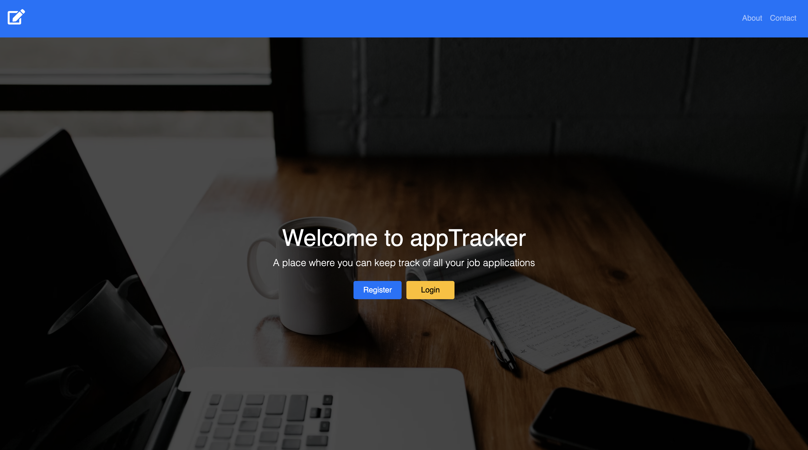
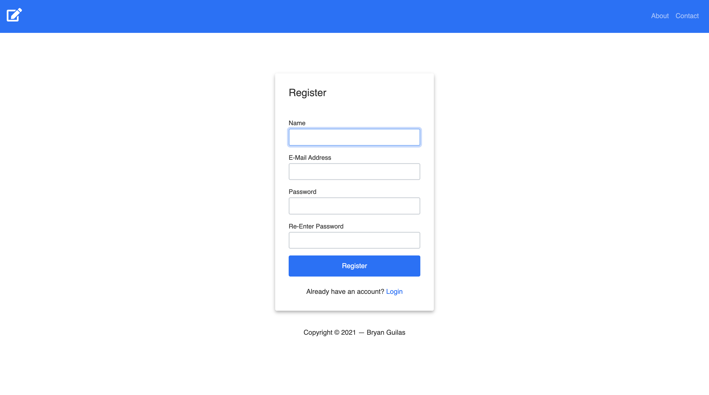
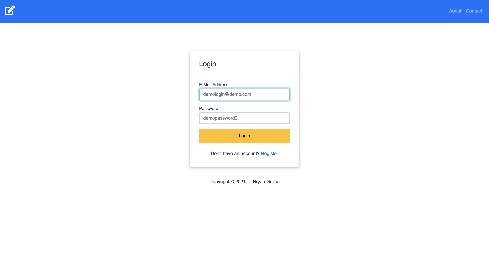
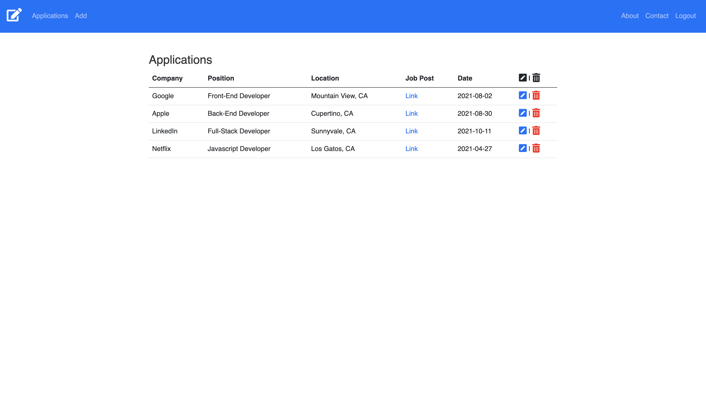
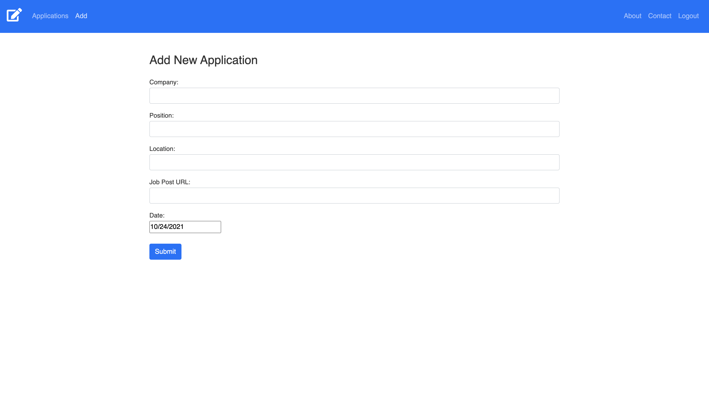

# appTracker

# URL: https://enigmatic-oasis-34459.herokuapp.com/

# About

This web application was created for a few reasons. One of the main reason was to help myself stay organized with
the job applications I was sending out. Another reason was to implement all that I have been learning and use it
to solve a real world problem I was having. With this application the user is given a way to keep organize by keeping track
of job application the user enters. AppTracker utilizes React in the Front-end, Node.JS, Express and MongoDB as it's Back-end and uses
JSON web token for authentication. The application is deployed through Heroku.
    
   # Technology
    React
    Redux
    Javascript
    Express
    HTML5
    CSS3
    Node.js
    Bootstrap 5
    MongoDB
    Mongoose
    Express
    JWT
    
# Screenshot

# Author
Bryan Guilas

Email: bryanJguilas@gmail.com

GitHub: https://github.com/BGM6

RepoUrl: https://github.com/BGM6/appTracker
